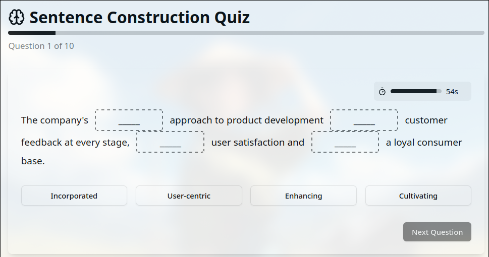
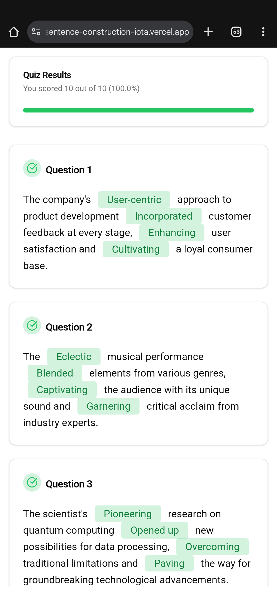
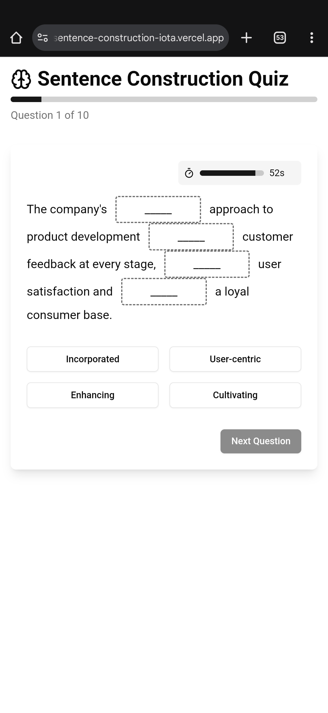
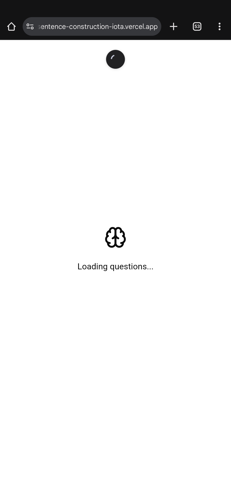

# Sentence Construction

A simple web application that helps users practice constructing sentences by providing a drag-and-drop interface to arrange words in the correct order.



## 🔍 Overview

Sentence Construction is an educational tool designed to help users improve their language skills through interactive sentence building exercises. Users can drag and drop words to form grammatically correct sentences, enhancing their understanding of sentence structure and grammar.

## 🌐 Live Demo

Visit the live application: [Sentence Construction App](https://sentence-construction-iota.vercel.app/)

## 🛠️ Tech Stack

- **Frontend**: React, vite, typescript
- **Styling**: Tailwind CSS
- **State Management**: React Context
- **Deployment**: Vercel

## 📁 Project Structure

```
sentence-construction/
├── src/
 ── App.css
├── App.tsx
├── components
│   ├── ErrorBoundry.tsx
│   ├── Question.tsx
│   ├── Results.tsx
│   ├── Timer.tsx
│   └── ui
│       ├── accordion.tsx
│       ├── alert-dialog.tsx
│       ├── alert.tsx
│       ├── aspect-ratio.tsx
│       ├── avatar.tsx
│       ├── badge.tsx
│       ├── breadcrumb.tsx
│       ├── button.tsx
│       ├── calendar.tsx
│       ├── card.tsx
│       ├── carousel.tsx
│       ├── chart.tsx
│       ├── checkbox.tsx
│       ├── collapsible.tsx
│       ├── command.tsx
│       ├── context-menu.tsx
│       ├── dialog.tsx
│       ├── drawer.tsx
│       ├── dropdown-menu.tsx
│       ├── form.tsx
│       ├── hover-card.tsx
│       ├── input-otp.tsx
│       ├── input.tsx
│       ├── label.tsx
│       ├── menubar.tsx
│       ├── navigation-menu.tsx
│       ├── pagination.tsx
│       ├── popover.tsx
│       ├── progress.tsx
│       ├── radio-group.tsx
│       ├── resizable.tsx
│       ├── scroll-area.tsx
│       ├── select.tsx
│       ├── separator.tsx
│       ├── sheet.tsx
│       ├── skeleton.tsx
│       ├── slider.tsx
│       ├── sonner.tsx
│       ├── switch.tsx
│       ├── table.tsx
│       ├── tabs.tsx
│       ├── textarea.tsx
│       ├── toaster.tsx
│       ├── toast.tsx
│       ├── toggle-group.tsx
│       ├── toggle.tsx
│       └── tooltip.tsx
├── hooks
│   └── use-toast.ts
├── index.css
├── lib
│   └── utils.ts
├── main.tsx
├── types
│   └── index.ts
└── vite-env.d.ts 
├── jsconfig.json
├── next.config.js
├── package-lock.json
├── package.json
├── postcss.config.js
├── public/
│   └── favicon.ico
├── README.md
└── tailwind.config.js
```

## ✨ Features

- Drag-and-drop interface for arranging words
- Immediate feedback on sentence correctness
- Mobile-responsive design
- Clean, intuitive user interface

## 🚀 Getting Started

### Prerequisites

- Node.js (v14.0.0 or later)
- npm or yarn

### Installation

1. Clone the repository:
   ```bash
   git clone https://github.com/knerd1/sentence-construction.git
   ```

2. Navigate to the project directory:
   ```bash
   cd sentence-construction
   ```

3. Install dependencies:
   ```bash
   npm install
   # or
   yarn install
   ```

4. Start the development server:
   ```bash
   npm run dev
   # or
   yarn dev
   ```

5. Open [http://localhost:3000](http://localhost:3000) in your browser to see the application.

## 🔄 How It Works

1. The application presents users with a set of words in a "word bank"
2. Users drag words from the bank and drop them in the sentence construction area
3. Once all words are arranged, the application checks if the sentence is correctly formed
4. Users receive feedback and Marks out of 10

## 📱 Responsive Design

The application is designed to work seamlessly across various device sizes:
- Desktop computers
- Tablets
- Mobile phones

## App Screenshots

<div style="display: flex; flex-direction: 'row';">




</div>
